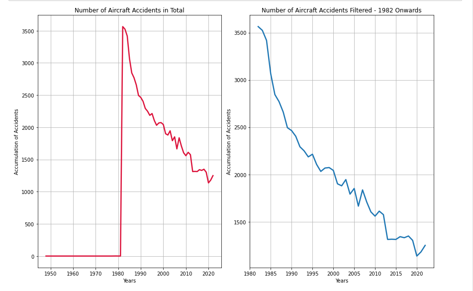

# Business Understanding

The project aims to identify the lowest-risk aircraft to support the 
company entry into exploring expansion into the airline industry. This 
insight will guide the head of the new aviation division in making informed 
purchasing decisions.

# Data Understanding

Importing Key Python libraries for data analysis and visualization
Loading 'AviationData.csv' file into a Pandas Datafram

## Data Preparation

Importing Key Python libraries for data analysis and visualization
Loading 'AviationData.csv' file into a Pandas Dataframe

# Exploratory Data Analysis

# Conclusion

Analysis is showing that the airline industry shows significant decline in 
incidences starting from 1985 to present a time, showing improvement in 
advancement in aviation technology can safety measures. Additionally, data 
shows that single-engine aircraft are more prone to accidents compared to 
two engine aircrafts. This is likely due to their mechanical limitations 
and operational vulnerabilities. Two engine aircraft provides good balance 
of power, efficiency and redundancy. This allows for a flight to continue 
even if one of the engines were to fail. These findings highlight the 
progress in aviation safety and any ongoing risks associated with smaller 
aircraft.

## Limitations

A clear limitation of this dataset is that the United States is the only 
country well-represented, while other countries have very few entries. 
Therefore, any conclusions drawn should primarily focus on aviation trends 
in the United States.

## Recommendations

To improve insight and decision-making, expanding data collection to 
include more countries is recommended for a more complete view of global 
aviation safety

## Next Steps

Next steps would include collecting more global data, improving accuracy, 
and analyzing trends to improve aviation safety. Collaboration with 
industry stakeholders and regulatory agencies can also reporting standards.
